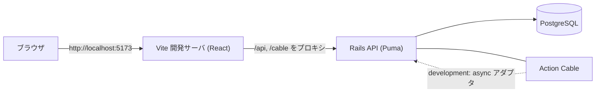
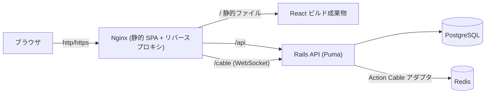
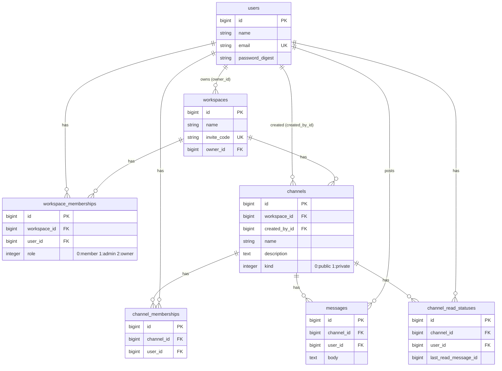

# TeamLink

TeamLink は Slack 風のチームチャットアプリです。ワークスペース・チャンネル・メッセージを使って、チーム内で情報共有ができます。

## 目次

- [アプリ概要](#アプリ概要)
- [制作背景](#制作背景)
- [主な機能](#主な機能)
- [認証方式](#認証方式)
- [使用技術](#使用技術)
- [システム構成](#システム構成)
- [ER 図](#er-図)
- [権限一覧](#権限一覧)
- [環境構築](#環境構築)
- [環境変数](#環境変数)
- [テスト・静的解析](#テスト静的解析)
- [デモアカウント](#デモアカウント)
- [デプロイ構成](#デプロイ構成)
- [今後の改善](#今後の改善)
- [自動コードレビュー](#自動コードレビュー)

## アプリ概要

TeamLink は、チーム内のコミュニケーションを一元化するためのチャットアプリです。ワークスペース単位でメンバーを管理し、公開／非公開のチャンネルに分けてメッセージをやり取りできます。Action Cable によるリアルタイム反映、未読件数の表示、ワークスペース横断のメッセージ検索に対応しています。

## 制作背景

- チーム内のコミュニケーションを 1 か所へ集約することを目的としています。
- 公開／非公開チャンネルにより、情報の公開範囲をコントロールできます。
- リアルタイム通信・未読管理・検索によって、日々のやり取りを効率化します。

## 主な機能

- ユーザー登録・ログイン・ログアウト
- ワークスペースの作成・参加・招待・退出・削除
- owner / admin / member の権限管理
- 公開／非公開チャンネル
- チャンネルの作成・更新・参加・招待・退出・削除
- メッセージの投稿・編集・削除
- Action Cable によるメッセージのリアルタイム反映
- 未読件数の表示と既読更新
- ワークスペース横断のメッセージ検索
- 非公開チャンネルの情報漏洩防止（権限のないユーザーへ本文・チャンネル名・件数を返さない）
- broadcast 失敗時のレスポンス整合性（DB 保存後に配信が失敗しても HTTP 成功を返し、再投稿による重複を防ぐ）

## 認証方式

JWT ではなく、**httpOnly セッション Cookie** による認証を採用しています。

- 認証情報は httpOnly のセッション Cookie（`_teamlink_session`）で保持し、JavaScript から読み取れないようにしています。
- 変更系リクエストは **CSRF トークン**（`X-CSRF-Token` ヘッダ）で保護します。
- 本番（`RAILS_ENV=production`）では Cookie に `Secure` 属性が付与され、HTTPS 前提（`force_ssl` / `assume_ssl`）で動作します。
- Cookie の `SameSite` は `Lax` です。
- CORS は `FRONTEND_ORIGIN` で許可オリジンを制御します。
- フロントと API は **同一オリジン構成**（本番では Nginx が `/api`・`/cable` をバックエンドへプロキシ）とし、`SameSite=Lax` の Cookie を素直に扱えるようにしています。

## 使用技術

バージョンは `backend/Gemfile.lock`・`frontend/package.json`・Docker 構成に基づく実際の値です。

### バックエンド

| 技術 | バージョン |
| --- | --- |
| Ruby | 3.3.2 |
| Ruby on Rails | 8.1.3 |
| PostgreSQL | 16（Docker イメージ） |
| Redis | 7（Docker イメージ） / `redis` gem 6.0.0 |
| Action Cable | Rails 同梱 |
| Puma | 8.0.2 |
| rack-cors | 3.0.0 |
| RSpec | rspec-rails 7.1.1 |

### フロントエンド

| 技術 | バージョン |
| --- | --- |
| React | 19 |
| TypeScript | 6 系 |
| Vite | 8 系 |
| Vitest | 4 系 |
| React Router | 7 系 |
| @rails/actioncable | 8 系 |
| Oxlint | 1 系 |

### インフラ・その他

| 技術 | バージョン／備考 |
| --- | --- |
| Nginx | 1.27（本番の静的配信 + リバースプロキシ） |
| Docker / Docker Compose | 開発・本番相当の両構成 |
| Node.js | 22（フロントのビルド） |
| GitHub Actions | プルリクエストの自動コードレビュー |
| Claude Code Review | PR の自動レビュー |

## システム構成

### 開発環境（docker compose）



### 本番相当環境（docker compose -f docker-compose.production.yml）



## ER 図

`backend/db/schema.rb` と各モデルに基づく実際のテーブル・関連です。



## 権限一覧

ワークスペースの役割ごとの主な操作範囲です（実装・spec に基づく）。

| 操作 | owner | admin | member |
| --- | :---: | :---: | :---: |
| ワークスペース閲覧 | ✓ | ✓ | ✓ |
| ワークスペース名の編集 | ✓ | ✓ | － |
| 招待コードの表示・再発行 | ✓ | ✓ | － |
| メンバーの削除（除名） | ✓ | ✓ | － |
| 自主退出 | ✓ (注) | ✓ | ✓ |
| 公開チャンネルの作成・参加 | ✓ | ✓ | ✓ |
| 非公開チャンネルの作成 | ✓ | ✓ | ✓ |
| 未参加の非公開チャンネルの閲覧 | ✓ | ✓ | － |
| チャンネルの編集・削除 | ✓ (注2) | ✓ (注2) | 作成者のみ |
| メッセージの投稿 | 参加チャンネルで可 | 参加チャンネルで可 | 参加チャンネルで可 |
| 他人のメッセージの編集・削除 | － | － | － |

- (注) owner の退出は仕様としてブロックしています（所有権移譲またはワークスペース削除が必要）。
- (注2) チャンネルの編集・削除は「チャンネル作成者」または「ワークスペースの owner / admin」が可能です。
- メッセージの編集・削除は投稿者本人のみ可能です。

## 環境構築

### 開発環境

必要ソフトウェア: Docker / Docker Compose。

```bash
# 1. リポジトリを取得
git clone https://github.com/KAT-brave/TeamLink.git
cd TeamLink

# 2. バックエンドの環境変数ファイルを作成（秘密値は各自設定）
cp backend/.env.example backend/.env

# 3. 起動（初回は backend が db:prepare を自動実行）
docker compose up --build
```

- フロントエンド: http://localhost:5173
- バックエンド API: http://localhost:3000 （API は `/api/v1` 配下）
- DB は開発用途でホスト 5434 番ポートに公開されます（他プロジェクトの 5432 と競合回避）。

デモデータを投入する場合（任意）:

```bash
# backend コンテナ内、またはローカルの backend ディレクトリで
bin/rails db:seed
```

停止:

```bash
docker compose down
```

### 本番相当環境

`docker-compose.production.yml` で、PostgreSQL / Redis / Rails / Nginx を本番相当の構成で起動できます。

```bash
# 1. 環境変数ファイルを作成（実値を設定。Git へは登録しない）
cp .env.production.example .env.production
#   RAILS_MASTER_KEY（config/master.key の内容）や DB/Redis の値を設定する

# 2. 起動
docker compose -f docker-compose.production.yml --env-file .env.production up --build
```

- フロントエンド（Nginx）: http://localhost:8080 （`FRONTEND_PORT` で変更可能）
- Nginx が `/api`・`/cable` をバックエンドへプロキシします（同一オリジン構成）。
- バックエンドはホストへ公開されません（Nginx 経由でのみアクセス）。

> **注意**: `.env.production` や `config/master.key` などの秘密情報は Git へ登録しないでください（`.gitignore` で除外済み）。

## 環境変数

秘密値そのものは記載しません。詳細は `backend/.env.example` と `.env.production.example` を参照してください。

### 開発用（`backend/.env.example`）

| 変数 | 用途 |
| --- | --- |
| `DB_HOST` / `DB_PORT` / `DB_USERNAME` / `DB_PASSWORD` | PostgreSQL 接続 |
| `DB_NAME` / `DB_NAME_TEST` | 開発／テスト DB 名 |
| `FRONTEND_ORIGIN` | CORS 許可オリジン |

### 本番用（`.env.production.example`）

| 変数 | 用途 |
| --- | --- |
| `RAILS_ENV` | `production` |
| `RAILS_MASTER_KEY` | credentials 復号キー（`config/master.key` の値） |
| `DATABASE_URL` | PostgreSQL 接続文字列 |
| `REDIS_URL` | Action Cable 用 Redis |
| `FRONTEND_ORIGIN` | CORS / Action Cable の許可オリジン |
| `POSTGRES_USER` / `POSTGRES_PASSWORD` / `POSTGRES_DB` | PostgreSQL 初期化 |
| `PORT` | Rails のリッスンポート |
| `FRONTEND_PORT` | Nginx の公開ポート（既定 8080） |
| `VITE_CABLE_URL` | Action Cable 接続先（ビルド時に反映。既定 `/cable`） |

## テスト・静的解析

### バックエンド

```bash
cd backend
# RSpec（DB は開発用の 5434 番ポートを利用）
DB_HOST=localhost DB_PORT=5434 DB_USERNAME=postgres DB_PASSWORD=postgres bundle exec rspec
# RuboCop
bundle exec rubocop
```

### フロントエンド

```bash
cd frontend
npm run test    # Vitest
npm run lint    # Oxlint
npm run build   # 本番ビルド
```

## デモアカウント

`bin/rails db:seed` で以下のデモアカウントが作成されます（`example.com` のダミーアドレス）。

| 役割 | メールアドレス | 備考 |
| --- | --- | --- |
| owner | demo-owner@example.com | 全チャンネルに参加 |
| admin | demo-admin@example.com | general / development / management に参加 |
| member | demo-member@example.com | general / development / support に参加 |
| 未所属 | demo-outsider@example.com | ワークスペース未所属（権限確認用） |

- パスワードは全アカウント共通の **`password1234`** です。
- **この共通パスワードはデモ専用です。本番運用では絶対に使用しないでください。**
- デモワークスペース: `TeamLink Demo`
- デモチャンネル: `general`（公開）/ `development`（公開）/ `management`（非公開）/ `support`（非公開）
- seed は冪等（`find_or_create_by!` を使用）で、複数回実行しても重大な重複は発生しません。既存データの削除も行いません。
- seed は **production では既定でスキップ**されます（強制する場合のみ `SEED_DEMO=true`。デモ用の弱いパスワードのため本番投入は非推奨）。

## デプロイ構成

- バックエンド本番イメージ: `backend/Dockerfile.production`（マルチステージ、production gem のみ、非 root 実行）
- フロントエンド本番イメージ: `frontend/Dockerfile.production`（Node でビルド → Nginx で静的配信）
- Nginx（`frontend/nginx.conf`）が静的 SPA を配信し、`/api`・`/cable` をバックエンドへ同一オリジンでプロキシ（WebSocket の HTTP Upgrade 対応、SPA フォールバック）
- PostgreSQL・Redis を含む本番相当 Compose: `docker-compose.production.yml`
- 特定クラウド（Render / Fly.io / AWS 等）への実デプロイは未実施です。
- 公開 URL: 準備中（未設定）。

## 今後の改善

今回の対象外として残っている項目です。

- メッセージ検索のページネーション
- pg_trgm 等による検索の高速化
- broadcast 失敗時の再試行（Active Job 化）
- 検索結果から対象メッセージへの移動（自動スクロール）
- 実クラウド環境へのデプロイ

## 自動コードレビュー

プルリクエストの作成・再オープン時に、GitHub Actions 上で Claude Code による自動コードレビューが実行され、指摘が PR コメントとして投稿されます。

- ワークフロー定義: [.github/workflows/claude-review.yml](.github/workflows/claude-review.yml)
- レビュー指針: [CLAUDE.md](CLAUDE.md)

### セットアップに必要な設定

リポジトリの `Settings → Secrets and variables → Actions` に、以下の Secret を登録してください。

| Secret 名 | 内容 |
| --- | --- |
| `CLAUDE_CODE_OAUTH_TOKEN` | ローカルで `claude setup-token` を実行して取得した OAuth トークン |
