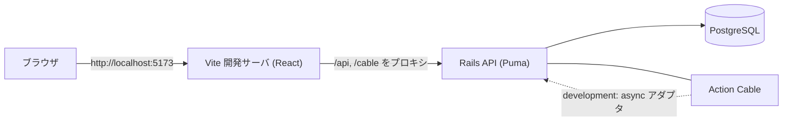
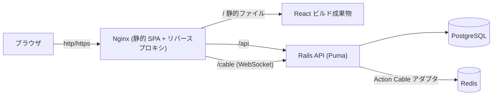
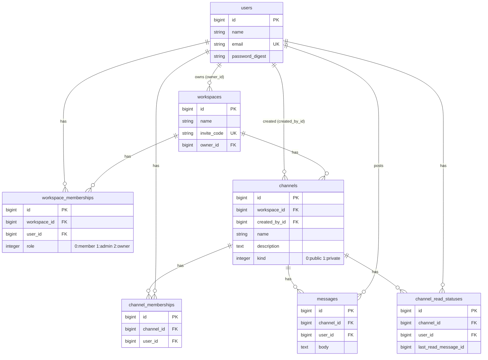
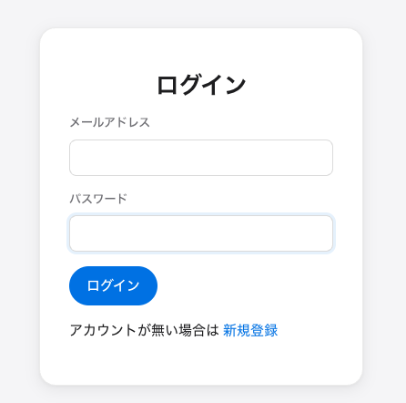
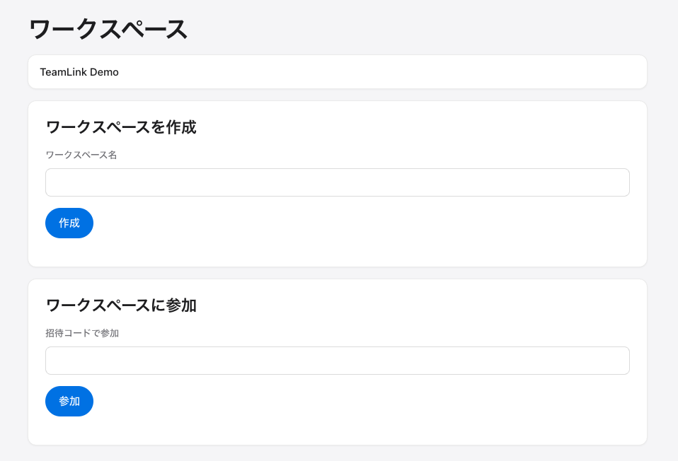
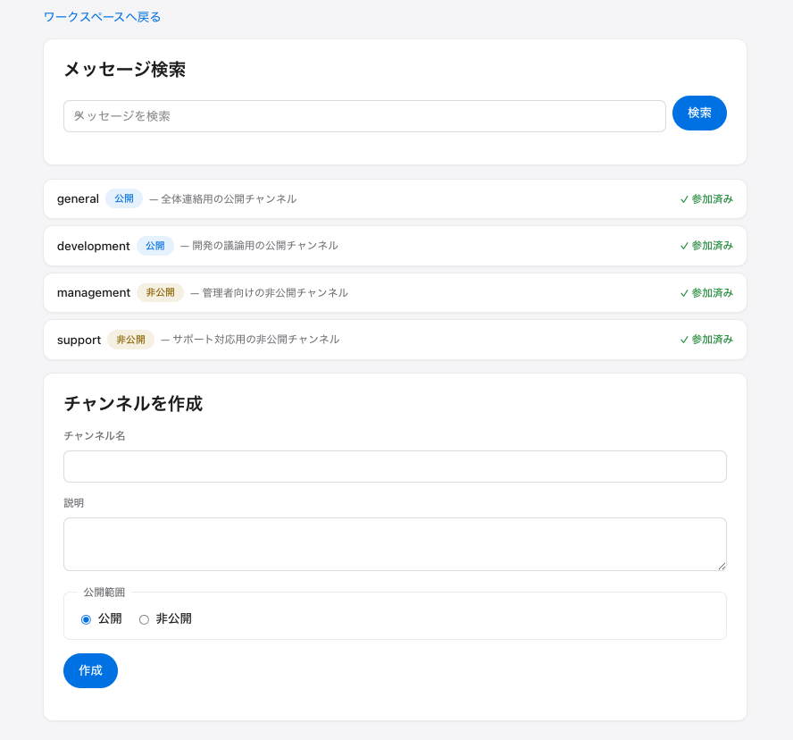
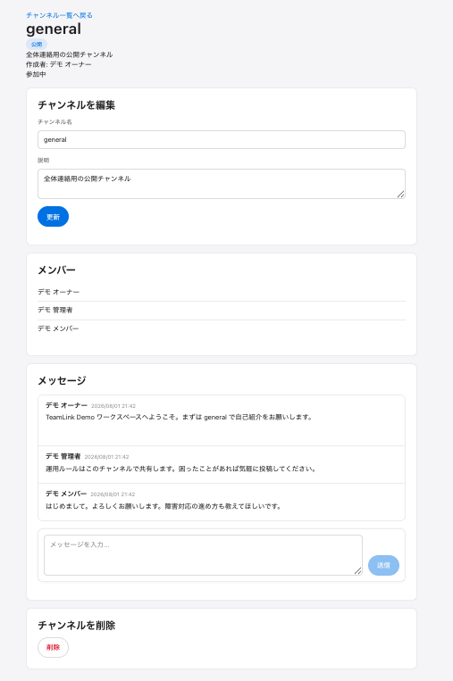
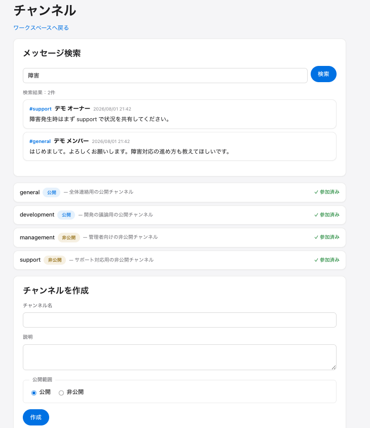
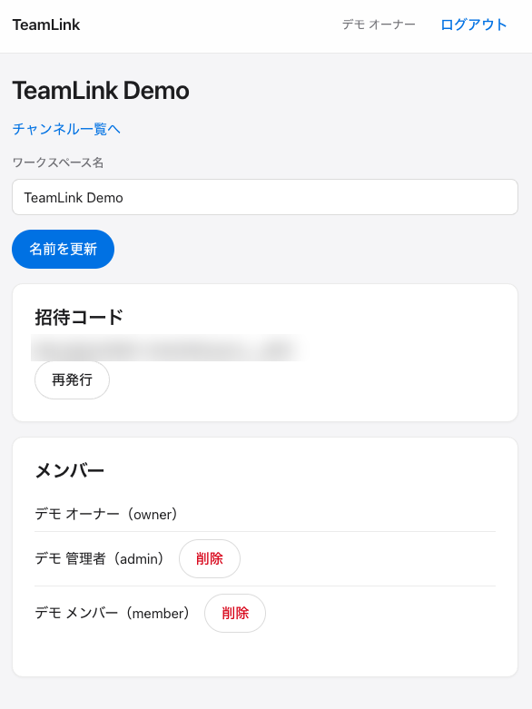

# TeamLink

**チーム内の会話を、公開／非公開チャンネルで整理できる Slack 風リアルタイムチャットアプリ**

TeamLink は、ワークスペース・チャンネル・メッセージでチーム内の情報共有を行う Web アプリケーションです。Rails API + React の分離構成で、リアルタイム通信・未読管理・横断検索・役割ベースの権限制御を実装しています。

---

## 公開状況

- Render への**デプロイ構成の作成**、Render Blueprint による **4 リソース（frontend / backend / db / redis）の作成**、**Frontend・Backend の起動確認（Deploy live）** まで実施しています。
- 公開 Frontend URL で、Apple 製品を参考にした登録画面が表示されることを確認済みです。
- 現在は **Render 無料プランのサービス間プライベートネットワーク制限**（無料 Web Service 間の通信が 502 になる）により、追加課金を避ける運用判断として**ライブデモを停止**しています。
- **ローカル Docker 環境**では、認証・ワークスペース・チャンネル・メッセージ・リアルタイム通信・未読管理・検索・権限制御を含む主要機能と、自動テストがすべて成功しています。

> ライブデモの常時公開は、有料 Backend プランまたは別ホスティングへの移行で再開できます（[今後の改善案](#今後の改善案)参照）。本 README はライブデモに依存せず、ローカル環境で全機能を再現・確認できるように構成しています。

---

## 目次

- [アプリ概要](#アプリ概要)
- [開発背景](#開発背景)
- [解決したい課題](#解決したい課題)
- [主な機能](#主な機能)
- [動作確認済み機能](#動作確認済み機能)
- [使用技術](#使用技術)
- [システム構成](#システム構成)
- [ER 図](#er-図)
- [権限設計](#権限設計)
- [セキュリティ](#セキュリティ)
- [テスト](#テスト)
- [ローカル起動方法](#ローカル起動方法)
- [デモアカウント](#デモアカウント)
- [Render デプロイ構成](#render-デプロイ構成)
- [スクリーンショット](#スクリーンショット)
- [技術的に工夫した点](#技術的に工夫した点)
- [今後の改善案](#今後の改善案)
- [自動コードレビュー](#自動コードレビュー)

---

## アプリ概要

TeamLink は、チーム内のコミュニケーションを 1 か所へ集約するためのチャットアプリです。ワークスペース単位でメンバーを管理し、公開／非公開のチャンネルに分けてメッセージをやり取りできます。Action Cable によるリアルタイム反映、未読件数の表示、ワークスペース横断のメッセージ検索に対応しています。

## 開発背景

- チーム内のコミュニケーションを 1 か所へ集約し、情報の散逸を防ぐことを目的としています。
- 公開／非公開チャンネルにより、情報の公開範囲をコントロールできるようにしました。
- リアルタイム通信・未読管理・検索によって、日々のやり取りを効率化することを目指しました。

## 解決したい課題

- チャットの情報が複数ツールに分散し、後から探しにくい。
- 全員に見せてよい情報と、一部メンバーだけに共有したい情報が混在してしまう。
- 未読・既読が分からず、重要な連絡を見落とす。
- 過去のメッセージを探すのに時間がかかる。

TeamLink は、公開／非公開チャンネル・未読管理・横断検索・役割ベースの権限で、これらの課題に対応します。

## 主な機能

- ユーザー登録・ログイン・ログアウト
- ワークスペースの作成・参加・招待・退出・削除
- owner / admin / member の権限管理
- 公開／非公開チャンネル
- チャンネルの作成・更新・参加・招待・退出・削除
- メッセージの投稿・編集・削除
- Action Cable によるメッセージのリアルタイム反映
- 未読件数の表示と既読更新
- ワークスペース横断のメッセージ検索
- 非公開チャンネルの情報漏洩防止（権限のないユーザーへ本文・チャンネル名・件数を返さない）
- broadcast 失敗時のレスポンス整合性（DB 保存後に配信が失敗しても HTTP 成功を返し、再投稿による重複を防ぐ）

## 動作確認済み機能

ローカル Docker 環境で、以下を実際に操作・確認済みです。

- [x] ユーザー登録
- [x] ログイン・ログアウト
- [x] ワークスペースの作成・参加・退出・削除
- [x] メンバー招待・権限管理
- [x] 公開／非公開チャンネル
- [x] チャンネルの参加・退出・削除
- [x] メッセージの投稿・編集・削除
- [x] リアルタイム反映（別ウィンドウへ再読み込みなしで反映）
- [x] 未読件数の表示
- [x] 既読更新（チャンネルを開くと未読が消える）
- [x] メッセージ検索
- [x] 非公開チャンネルの検索秘匿（未参加ユーザーへ内容・件数を返さない）
- [x] owner / admin / member の権限制御
- [x] 別ワークスペースへのアクセス防止（404 で秘匿）
- [x] レスポンシブ表示（375px / 768px / 1280px）

## 使用技術

バージョンは `backend/Gemfile.lock`・`frontend/package.json`・Docker 構成に基づく実際の値です。

### バックエンド

| 技術 | バージョン |
| --- | --- |
| Ruby | 3.3.2 |
| Ruby on Rails | 8.1.3 |
| PostgreSQL | 16（Docker イメージ） |
| Redis | 7（Docker イメージ） / `redis` gem 6.0.0 |
| Action Cable | Rails 同梱 |
| Puma | 8.0.2 |
| rack-cors | 3.0.0 |
| RSpec | rspec-rails 7.1.1 |

### フロントエンド

| 技術 | バージョン |
| --- | --- |
| React | 19 |
| TypeScript | 6 系 |
| Vite | 8 系 |
| Vitest | 4 系 |
| React Router | 7 系 |
| @rails/actioncable | 8 系 |
| Oxlint | 1 系 |

### インフラ・その他

| 技術 | バージョン／備考 |
| --- | --- |
| Nginx | 1.27（本番の静的配信 + リバースプロキシ） |
| Docker / Docker Compose | 開発・本番相当の両構成 |
| Node.js | 22（フロントのビルド） |
| Render | Blueprint（`render.yaml`）による構成 |
| GitHub Actions | プルリクエストの自動コードレビュー |
| Claude Code Review | PR の自動レビュー |

## システム構成

### 開発環境（docker compose）



### 本番相当環境（docker compose -f docker-compose.production.yml / Render）



## ER 図

`backend/db/schema.rb` と各モデルに基づく実際のテーブル・関連です。



## 権限設計

ワークスペースの役割ごとの主な操作範囲です（実装・spec に基づく）。

| 操作 | owner | admin | member |
| --- | :---: | :---: | :---: |
| ワークスペース閲覧 | ✓ | ✓ | ✓ |
| ワークスペース名の編集 | ✓ | ✓ | － |
| 招待コードの表示・再発行 | ✓ | ✓ | － |
| メンバーの削除（除名） | ✓ | ✓ | － |
| 自主退出 | ✓ (注) | ✓ | ✓ |
| 公開チャンネルの作成・参加 | ✓ | ✓ | ✓ |
| 非公開チャンネルの作成 | ✓ | ✓ | ✓ |
| 未参加の非公開チャンネルの閲覧 | ✓ | ✓ | － |
| チャンネルの編集・削除 | ✓ (注2) | ✓ (注2) | 作成者のみ |
| メッセージの投稿 | 参加チャンネルで可 | 参加チャンネルで可 | 参加チャンネルで可 |
| 他人のメッセージの編集・削除 | － | － | － |

- (注) owner の退出は仕様としてブロックしています（所有権移譲またはワークスペース削除が必要）。
- (注2) チャンネルの編集・削除は「チャンネル作成者」または「ワークスペースの owner / admin」が可能です。
- メッセージの編集・削除は投稿者本人のみ可能です。

## セキュリティ

- **認証**: JWT ではなく **httpOnly セッション Cookie**（`_teamlink_session`）を採用し、JavaScript から読み取れないようにしています。
- **CSRF 対策**: 変更系リクエストは **CSRF トークン**（`X-CSRF-Token` ヘッダ）で保護します。
- **本番 Cookie**: `RAILS_ENV=production` では `Secure` 属性・`SameSite=Lax`・HTTPS 前提（`force_ssl` / `assume_ssl`）で動作します。
- **同一オリジン構成**: 本番は Nginx が `/api`・`/cable` をバックエンドへプロキシし、フロントと API を同一オリジンにすることで `SameSite=Lax` Cookie を素直に扱います。
- **CORS**: 許可オリジンを `FRONTEND_ORIGIN` で制御します。
- **Host Authorization**: 本番では DNS リバインディング保護を有効に保ち、`FRONTEND_ORIGIN` のホストのみを許可（不正・スキームなしの値は起動時に明示エラー）。backend 公開 URL 経由の直接アクセスは許可しません。
- **情報秘匿**: 権限のない非公開チャンネルは、本文・チャンネル名・件数・存在自体を返しません。未所属のワークスペース／リソースは **404** で秘匿します。
- **権限検証はバックエンドで実施**: フロントの表示制御は UX 目的であり、権限判定の正はサーバ側にあります。
- **秘密情報の非コミット**: `config/master.key`・`.env.production` 等は Git 管理外（`.gitignore`）です。

## テスト

品質管理として、バックエンド・フロントエンド・インフラ構成の各層で検証しています（直近のローカル実行結果）。

### バックエンド

- RSpec: **342 examples, 0 failures**
- RuboCop: **88 files, no offenses**

### フロントエンド

- Vitest: **117 tests passed**
- Oxlint: **errors 0**（既存 warning 1 件のみ）
- production build: **success**

### インフラ

- Backend production image build: success
- Frontend production image build: success
- Nginx 設定テスト（`nginx -t`）: success
- production Compose（`docker compose config`）: valid
- WebSocket（`/cable`）の HTTP Upgrade: **101 Switching Protocols** を確認
- Render Blueprint 同期: 成功（4 リソース作成）
- Frontend・Backend の Deploy live: 確認済み

## ローカル起動方法

ライブデモに依存せず、ローカルで全機能を再現できます。

### 必要環境

- Docker / Docker Compose

### 手順

```bash
# 1. リポジトリを取得
git clone https://github.com/KAT-brave/TeamLink.git
cd TeamLink

# 2. バックエンドの環境変数ファイルを作成（秘密値は各自設定）
cp backend/.env.example backend/.env

# 3. 起動（初回は backend が db:prepare でDB作成＋マイグレーションを自動実行）
docker compose up --build

# 4. デモデータを投入（任意。ログイン確認用）
docker compose exec backend bin/rails db:seed
```

- フロントエンド: <http://localhost:5173>
- バックエンド API: <http://localhost:3000>（API は `/api/v1` 配下）
- DB は開発用途でホスト 5434 番ポートに公開されます（他プロジェクトの 5432 と競合回避）。

### 停止

```bash
docker compose down
```

## デモアカウント

`bin/rails db:seed` で以下のデモアカウントが作成されます（`example.com` のダミーアドレス）。**ローカルデモ環境専用**です。

| 役割 | メールアドレス | 備考 |
| --- | --- | --- |
| owner | demo-owner@example.com | 全チャンネルに参加 |
| admin | demo-admin@example.com | general / development / management に参加 |
| member | demo-member@example.com | general / development / support に参加 |
| 未所属 | demo-outsider@example.com | ワークスペース未所属（権限確認用） |

- パスワードは全アカウント共通の **`password1234`** です。
- **この共通パスワードはローカルデモ環境専用です。本番運用では絶対に使用しないでください。**
- デモワークスペース: `TeamLink Demo`
- デモチャンネル: `general`（公開）/ `development`（公開）/ `management`（非公開）/ `support`（非公開）
- seed は冪等（`find_or_create_by!` を使用）で、複数回実行しても重大な重複は発生しません。既存データの削除も行いません。
- seed は **production では既定でスキップ**されます（強制する場合のみ `SEED_DEMO=true`）。

## Render デプロイ構成

Render Blueprint（[`render.yaml`](render.yaml)）で、TeamLink 専用の 4 リソースを定義しています。デプロイ手順の詳細は [`docs/render-deployment.md`](docs/render-deployment.md) を参照してください。

| リソース | 種類 | 役割 |
| --- | --- | --- |
| `teamlink-frontend` | Docker Web Service | React production build を Nginx で配信・SPA 配信・`/api` プロキシ・`/cable` WebSocket プロキシ |
| `teamlink-backend` | Docker Web Service | Rails API・Puma・Action Cable・起動時に `db:prepare`（マイグレーションのみ、seed は自動実行しない） |
| `teamlink-db` | PostgreSQL | TeamLink 専用データベース |
| `teamlink-redis` | Redis | Action Cable 用（TeamLink 専用） |

- これら 4 リソースは、同一 Render アカウント上の別プロジェクト **SupportLog とは完全に独立**しており、SupportLog の DB・Redis・環境変数・URL を一切参照しません。
- **ライブデモは現在停止中**です。Render 無料 Web Service 間のプライベートネットワーク制限により Frontend → Backend 通信が 502 になるため、追加課金を避ける運用判断として公開を止めています。公開 URL は本 README には掲載していません（誤って利用できない URL を「デモはこちら」として案内しないため）。

## スクリーンショット

ローカルデモ環境（`TeamLink Demo` ワークスペース／デモアカウント）の画面です。

### ログイン画面



### ワークスペース一覧



### チャンネル一覧



### メッセージ画面



### メッセージ検索



### スマートフォン表示



## 技術的に工夫した点

- **Rails API と React の分離構成**: バックエンドは API 専用、フロントは Vite + React。開発は Vite プロキシ、本番は Nginx プロキシで同一オリジン化。
- **httpOnly Cookie + CSRF 認証**: JWT を使わず、XSS に強い httpOnly セッション Cookie と CSRF トークンで認証。本番は Secure / SameSite / HTTPS 前提。
- **ワークスペース単位の権限分離**: owner / admin / member の役割で操作範囲を制御し、権限判定はすべてバックエンドで実施。
- **公開・非公開チャンネルの情報秘匿**: 権限のない非公開チャンネルは本文・チャンネル名・件数・存在を返さない。
- **未所属リソースの 404 秘匿**: 未所属のワークスペース／チャンネルは、存在を悟らせないため 404 を返す。
- **Action Cable + Redis のリアルタイム通信**: 投稿・編集・削除を接続中クライアントへ即時反映。本番は Redis アダプタ。
- **未読件数と既読管理**: `channel_read_statuses` で最終既読位置を管理し、未読件数を N+1 なく算出、チャンネル閲覧で既読化。
- **検索での非公開チャンネル除外**: ワークスペース横断検索で、閲覧権限のあるチャンネルのみを対象とし、非公開チャンネルの内容・件数を漏らさない。
- **broadcast 失敗時のレスポンス整合性**: DB 保存後に配信が失敗しても HTTP 成功を返し、ユーザーの再投稿による重複を防止（配信失敗はログに記録）。
- **Apple 製品を参考にしたレスポンシブ UI**: デザイントークンを一元管理し、375px / 768px / 1280px に対応。
- **Docker による開発環境の統一**: 開発・本番相当の両 Compose を用意し、環境差を吸収。
- **多層の品質管理**: RSpec / Vitest による自動テストと、RuboCop / Oxlint による静的解析。
- **PR の自動レビュー**: GitHub Actions 上で Claude Code Review を実行し、指摘を PR コメントとして受け取り改善。
- **Render Blueprint によるデプロイ構成**: `render.yaml` で PostgreSQL・Redis・Nginx を含む 4 リソースを IaC 的に定義。Nginx 設定は環境変数から起動時生成し、ポート／ホストをソースへ固定しない。
- **制約調査と運用判断**: Render 無料プランのサービス間ネットワーク制限を検証で特定し、安全性と費用を考慮してライブ公開を停止する判断を行った（構成・手順は検証済みで、有料 Backend または別ホスティングで再公開可能）。

## 今後の改善案

- **ライブデモの再公開**: 有料 Backend プラン、または別ホスティングへの移行によるライブデモの常時公開。
- 画像アップロード
- スレッド返信
- メッセージへのリアクション
- 通知
- ユーザープロフィール
- E2E テストの追加
- 監視・ログ・バックアップの強化

## 自動コードレビュー

プルリクエストの作成・再オープン時に、GitHub Actions 上で Claude Code による自動コードレビューが実行され、指摘が PR コメントとして投稿されます。

- ワークフロー定義: [.github/workflows/claude-review.yml](.github/workflows/claude-review.yml)
- レビュー指針: [CLAUDE.md](CLAUDE.md)

### セットアップに必要な設定

リポジトリの `Settings → Secrets and variables → Actions` に、以下の Secret を登録してください。

| Secret 名 | 内容 |
| --- | --- |
| `CLAUDE_CODE_OAUTH_TOKEN` | ローカルで `claude setup-token` を実行して取得した OAuth トークン |
